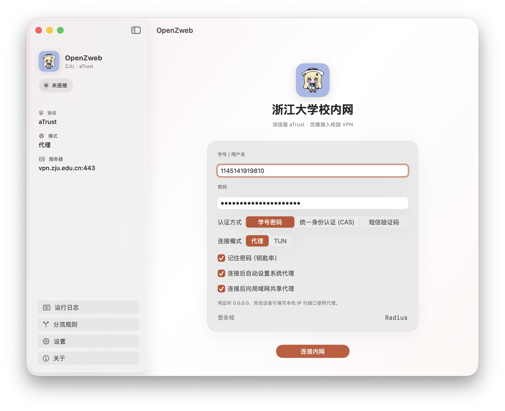

<p align="center">
  
</p>

<h1 align="center">OpenZweb</h1>

<p align="center">
  浙江大学校园 VPN 原生 <b>macOS</b> 客户端 · 深信服 <b>aTrust</b> 协议<br>
  基于 <a href="https://github.com/Mythologyli/zju-connect">zju-connect</a> · 兼容 <a href="https://github.com/chenx-dust/EZ4Connect">EZ4Connect</a>
</p>

<p align="center">
  <a href="https://github.com/diyanqi/OpenZweb/releases"></a>
  <a href="https://github.com/diyanqi/OpenZweb/actions"></a>
  
  
</p>

---

> **免责声明**
>
> 本项目为非官方、社区维护的开源工具，与浙江大学、深信服科技及任何 VPN 服务提供商均无隶属或授权关系。  
> 仅供学习、科研与个人网络调试用途。请遵守学校信息技术管理规定、相关服务条款与所在地法律法规。  
> 使用本软件产生的账号风险、服务封禁、数据安全问题等，均由使用者自行承担。作者与贡献者不提供任何明示或默示担保，也不对使用后果负责。  
> **请勿用于任何违反校规、法律或服务协议的行为。**

学号密码登录后，通过 **SOCKS5/HTTP 代理** 或 **TUN 虚拟网卡** 访问校内网。默认服务器：`vpn.zju.edu.cn`。

## 界面预览

<p align="center">
  
</p>

---

## 打开提示「已损坏，无法打开」怎么办？

从 GitHub Releases 下载的应用 **未经过 Apple 公证**（社区开源构建），macOS Gatekeeper 有时会误报：

> “OpenZweb”已损坏，无法打开。你应该将它移到废纸篓。

这不是安装包真的损坏，而是隔离属性 / 未公证签名触发的保护。任选一种方式：

**方式一（推荐，终端一行）：**

```bash
# 若装在「应用程序」：
sudo xattr -dr com.apple.quarantine /Applications/OpenZweb.app

# 若还在下载目录，把路径改成实际 .app 位置，例如：
# xattr -dr com.apple.quarantine ~/Downloads/OpenZweb.app
```

然后重新双击打开。

**方式二（图形界面）：**

1. 打开「系统设置 → 隐私与安全性」  
2. 若底部出现「仍要打开 OpenZweb」，点 **仍要打开**  
3. 或在 Finder 中 **右键 / 双指点按** OpenZweb.app → **打开** → 确认打开  

> 发行版 DMG 会尽量做 ad-hoc 签名并清理隔离属性；若浏览器仍给下载文件打上 quarantine，用上面命令即可。

---

## 功能

- aTrust / EasyConnect 协议（引擎：`zju-connect`，DMG 已内置）
- 学号密码 · 图形人机验证（应用内 WebView）· 短信 OTP
- **代理模式**（默认，无需管理员）/ **TUN 模式**（需管理员）
- 系统代理自动管理（可关，便于与 Clash 等共存）
- 局域网共享代理（展示本机连接信息，供其他设备填写）
- 独立 **分流规则** 页：白名单（强制走 VPN）/ 黑名单（系统代理绕过）
- 短信二次认证：可选「跳过以后的短信验证」（见下文）
- 启动检查更新（仅提示，不自动安装；大陆镜像优先）
- 钥匙串记住密码 · 实时网速 · 公网 IP/归属地 · 浙大导航入口
- 菜单栏快捷操作（托盘为系统小图标）

---

## 语言 / Languages

界面跟随系统语言（**系统设置 → 语言与地区**）：

| Language | Code |
|----------|------|
| English | `en` |
| 简体中文 | `zh-Hans` |
| 繁體中文 | `zh-Hant` |

重启应用后生效。字符串目录：`OpenZweb/Resources/Localizable.xcstrings`。

## 环境

- macOS 14+
- Apple Silicon（arm64）优先；Release DMG 由 GitHub Actions 构建
- 本地编译建议 Xcode 26.x

---

## 快速开始

### 下载安装（推荐）

从 [Releases](https://github.com/diyanqi/OpenZweb/releases) 下载 `OpenZweb-*-macos-arm64.dmg`，拖入「应用程序」。

DMG **已内置** `zju-connect` 协议引擎，一般无需再下载。

### 从源码编译

```bash
# 可选：本地准备引擎（CI 会自动下载）
./Scripts/download-core.sh

open OpenZweb.xcodeproj   # ⌘R
```

命令行：

```bash
DEVELOPER_DIR=/Applications/Xcode.app/Contents/Developer \
xcodebuild -project OpenZweb.xcodeproj -scheme OpenZweb -configuration Debug \
  -derivedDataPath build CODE_SIGN_IDENTITY="-" CODE_SIGNING_ALLOWED=NO build

open build/Build/Products/Debug/OpenZweb.app
```

### 连接

1. 输入学号与密码  
2. 选择 **代理** 或 **TUN**  
3. 完成人机验证与短信（如有）  
4. 代理模式默认：
   - SOCKS5：`127.0.0.1:1080`
   - HTTP：`127.0.0.1:1081`

```bash
curl -x socks5h://127.0.0.1:1080 https://www.cc98.org
```

校内论坛域名为 **`www.cc98.org`**（不是 98cc.org）。

---

## 与其他代理共存

1. 关闭 OpenZweb 的「连接后自动设置系统代理」  
2. 其他代理继续管理系统代理  
3. 在其他代理中将 `*.zju.edu.cn`、`cc98.org` 等走 OpenZweb 的 SOCKS  
4. **`vpn.zju.edu.cn` 必须直连**（勿进 Fake-IP）

---

## 分流规则

侧栏 **分流规则**（修改后重新连接生效）：

| 类型 | 作用 |
|------|------|
| 白名单 | 写入 zju-connect `custom_proxy_domain`（TOML 数组），强制走校园 VPN |
| 黑名单 | 写入系统代理绕过列表 / 导出 PAC 中的直连域名 |

支持逗号或换行分隔，如 `science.org, nature.com`。

---

## 短信「跳过以后的短信验证」

对应 [EZ4Connect 实现](https://github.com/chenx-dust/EZ4Connect/commit/6728892e022adbe1e7cb24709dbfa517b433b7fc) 与 zju-connect 提示：

> Tips: Add prefix `$` to sms code to skip secondary authentication

### 原理

aTrust 登录成功后，若触发**二次增强认证**（短信），引擎会提示：

- `Please enter the SMS verification code:` → **二次短信**（可跳过后续）
- `Please enter your SMS code:` → **主短信登录**（无跳过项）

在二次短信场景下，若在验证码前加 **`$`** 再提交（例如真实验证码为 `123456`，则提交 `$123456`），会向服务端带上 `skipSecondaryAuth` 意图，请求**跳过以后的二次短信验证**。

OpenZweb 在二次短信弹窗中提供复选框「跳过以后的短信验证」；勾选后自动加 `$` 前缀。设置中可「默认勾选」。

### 注意

- 是否真正生效取决于学校 aTrust 策略与账号风控，**不保证**每次可用  
- 仅作用于二次短信提示，不会绕过首次密码 / 人机验证  
- 请勿滥用；请遵守校规与服务条款

---

## 检查更新

- 启动时可自动检查（设置中可关）  
- 设置 / 菜单栏可手动「检查更新」  
- **只检查、不自动安装**  
- API 优先走大陆可达镜像（ghfast / ghproxy 等），再回落 `api.github.com`

---

## 发布 / DMG（GitHub Actions）

推送版本标签触发构建（内置引擎）并上传 Release：

```bash
git tag v1.0.0
git push origin v1.0.0
```

也可在 Actions 页手动 `workflow_dispatch`。

本地打包：

```bash
./Scripts/download-core.sh
xcodebuild -project OpenZweb.xcodeproj -scheme OpenZweb -configuration Release \
  -derivedDataPath build CODE_SIGN_IDENTITY="-" CODE_SIGNING_ALLOWED=NO build
./Scripts/package-dmg.sh --app build/Build/Products/Release/OpenZweb.app --version 1.0.0
```

---

## 项目结构

```
OpenZweb/              # SwiftUI 应用
docs/assets/           # README 图标
docs/screenshots/      # 界面截图
Core/                  # zju-connect 二进制（本地/CI 放入）
Scripts/               # download-core / package-dmg 等
Tools/                 # 空 open 桩，抑制人机验证弹系统浏览器
.github/workflows/     # Release DMG
icons/                 # 源图标（Icon Composer）
```

---

## 鸣谢

- [diyanqi/OpenZweb](https://github.com/diyanqi/OpenZweb) — 本项目  
- [Mythologyli/zju-connect](https://github.com/Mythologyli/zju-connect) — 协议引擎  
- [Mythologyli/ZJU-Connect-for-Windows](https://github.com/Mythologyli/ZJU-Connect-for-Windows) — Windows 客户端参考  
- [chenx-dust/EZ4Connect](https://github.com/chenx-dust/EZ4Connect) — aTrust 研究与二次短信 `$` 跳过  
- [kaixuanwang2003/zju-welcome](https://github.com/kaixuanwang2003/zju-welcome/) — 浙大导航 [zjuers.com](https://zjuers.com/)

---

## 许可证

源码以仓库内声明为准；`zju-connect` 等第三方组件遵循其各自许可证。使用本软件即表示你已阅读并同意文首免责声明。
